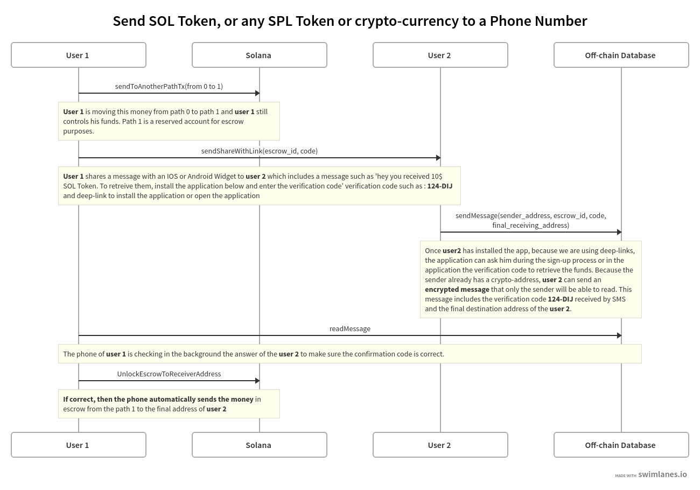

# Crypto Please Protocol

## DEFI demystified, for everyone.

Up to now, the DeFi space has been uninviting for most, with high barrier to entry. The significant rewards involved in DeFi have only been reserved for those with technical skills and geeky attitude. To be able to access DEFI and start earning great yield with stable coins, most people had to understand the complext concept of private key and crypto-address. The problem wasn't with DeFi yields all along. It was with the barrier to entry which made it exclusive for everyday people.
Solana is the perfect blockchain to be able to pay people in USDC for example, but people still need to understand how it works.
We were thinking how it would be possible to send USDC with Solana to a phone number or to an email then.

## State of the art
There has been some solutions such as CELO that aimed to simplify how people can access DeFi, yet upon research, we found some significant flaws which we have listed below. After reviewing other protocols, like the CELO protocol, we found some flaws:
- ID of phone numbers are stored on the chain even if they are encrypted
- you need to have a positive balance of CeloUSD to get the crypto-addresses of a phone number
- it is not possible to send money to a user that has not been registered before.

So the CELO protocol is not blockchain agnostic, and has inherend privacy issues since some private information are stored in the blockchain.
Another side of the same coin is neo-bank application. One key element of Neo-bank application is to able to send money to a phone number to non registered users. This feature increases the traction of neo-banks application, because the new user has a great incentive to register on the application to claim the money waiting for the user to collect.

## Here comes the Crypto Please protocol
Crypto Please Protocol provides a protocol to generate payment links and associated verification code. Only a user who has access to a payment link and its associated verication code can widthdraw some crypto. These payments link are universal which means they can works accross different wallets. The protocol is non-custodial meaning during all the transfer, no third party are involved.
The Crypto Please Protocol enables to send SOL token, SPL token or any crypto-currency to a phone number or an email address via payment links. The protocol is:
- non custodial
- universal (works with all crypto) and no smart-contract involved.
- keeps full-privacy (zero information is leaking on the blockchain)
- can be implemented by any existing crypto-wallet (Trust Wallet, Coin98 etc..) to send payment links without any difficulty to increase their user-base

## How it works
We use deep-link to make sure any user (registered or non-registered) can widthdraw their funds from the payment link. Then we verify the identity of the person who wants to widthdraw the fund by asking him to confirm the verification code associated to the payment link. Then we encrypted the verification code (because we can use Solana address to encrypt messages) into a off-chain database where only the sender can read the answer. We use silent push notification background task to unlock the money on the sender phone after the sender phone has successfully verified that the verification code provided is correct.

## Source Code Repos Solana Defi Hackathon
We worked on 2 repos. A Solana Dart Library and our Flutter application. We are implementing our Solana Dart Library into the flutter application later this week.

We add @rmshea and @mattytay on our 2 repos:
- [Solana Dart Library](https://github.com/cryptoplease/dart-solana-lib)
- [Flutter Mobile App](https://github.com/cryptoplease/crypto-please) 

## Customer oriented product development
Using this protocol, we plan to develop it into a beautiful wallet in which the power of DeFi and blockchain technology is working seamlessly in the background. Here is our deck on how the wallet will look like, and what can be expected:

[Pitch deck](CryptoPlease-Defi-Solana.pdf)

## Why we are not using Solana Smart Contract for the escrow
Well we could, but we doubt lots of wallet will adopt it because then it would be more work for wallets to implement it. In our protocol, the wallet implementation is very easy and can be expend to any kind of tokens, SOL, SPL, Bitcoin, ETH etc...

## Team
We are 6 anonymous people very experienced with coding, blockchain, finance, marketing, and design skills.
